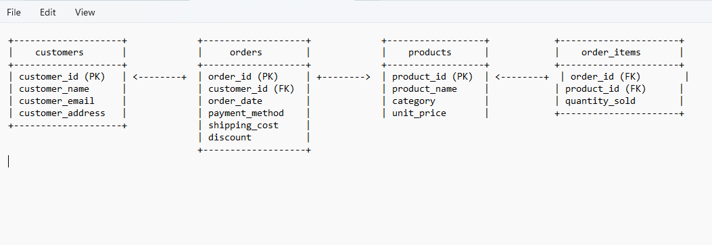

# Sales Data Load and API

## Overview

Loads data from CSV to database and Expose API to fetch data from database.

## Schema Diagram

# API Documentation

## List of Available Routes

| Route                | Method | Query Params                                  | Body                                      | Description                                                           | Sample Response                                                                  |
|----------------------|--------|-----------------------------------------------|-------------------------------------------|-----------------------------------------------------------------------|----------------------------------------------------------------------------------|
| `/datarefresh`       | POST   | N/A                                           | N/A                                       | Refreshes the sales data by loading from the provided CSV file.       | `{ "result": "Data refreshed successfully" }`                                    |
| `/getrevenue`        | GET    | `startDate` (required), `endDate` (required)   | N/A                                       | Retrieves the total revenue between a date range.                     | `{ "result": { "sum": 10000 } }`                                                 |
| `/gettopproducts`    | GET    | `startDate` (required), `endDate` (required), `limit` (optional) | N/A                                       | Retrieves the top-selling products within a date range.                | `{ "result": [ { "product_name": "Product 1", "total_sold": 200 }, ... ] }`     |

## Prerequisites

Before running the application, ensure that you have the following installed:

1. **Node.js** 
   - Download and install Node.js.

2. **PostgreSQL** 
   - Install PostgreSQL.

3. **Environment Variables**
   - The application relies on a `.env` file for configuration. Example `.env` content:
